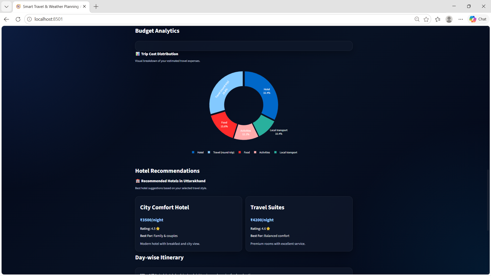
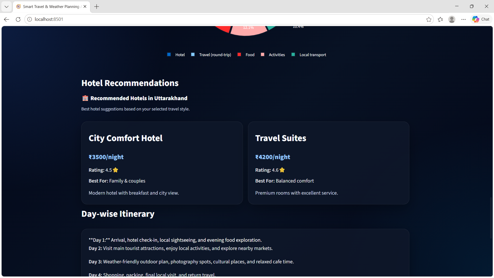
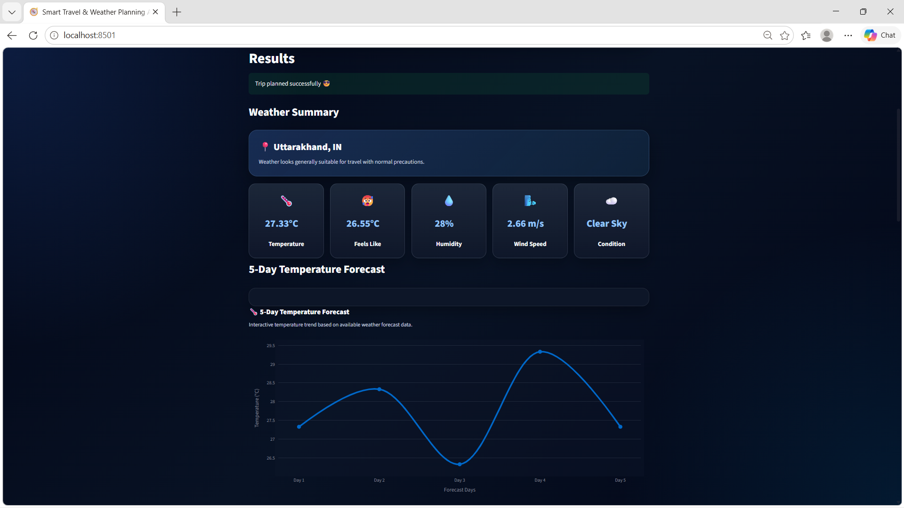

# 🌍 Smart Travel & Weather Planning Agent

An AI-powered multi-agent travel planning system built using **Streamlit, CrewAI, LangChain, Gemini API, OpenWeather API, and Plotly**.

This project helps users generate smart travel plans with:

* Real-time weather insights
* Budget estimation
* AI-generated itinerary
* Interactive analytics
* PDF travel report export

---

# ✨ Features

## 🌦️ Real-Time Weather Analysis

* Current weather conditions
* Temperature insights
* Humidity & wind speed
* Weather suitability notes
* 5-day temperature forecast graph

## 💰 Smart Budget Planning

* Budget estimation
* Travel expense breakdown
* Interactive donut analytics chart
* Budget warning system

## 🧠 Agentic AI Workflow

This project uses multiple AI agents:

* Weather Agent
* Budget Agent
* Travel Planner Agent

Each agent performs a dedicated task to generate a complete travel plan.

## 🗺️ AI Travel Itinerary

* Day-wise trip planning
* Smart recommendations
* Packing checklist
* Final travel advice

## 🏨 Hotel Recommendation Cards

* Budget / Standard / Premium hotel suggestions
* Ratings and descriptions
* Premium glassmorphism UI

## 📄 PDF Export

Download complete travel reports including:

* Weather summary
* Budget breakdown
* Itinerary
* Packing checklist

---

# 🛠️ Tech Stack

* Python
* Streamlit
* CrewAI
* LangChain
* Google Gemini API
* OpenWeather API
* Plotly
* FPDF2

---

# 🚀 Installation

## Clone Repository

```bash
git clone https://github.com/abhay-singh-bisht12/Smart-Travel-Weather-Planning-Agent.git
cd Smart-Travel-Weather-Planning-Agent
```

## Install Dependencies

```bash
pip install -r requirements.txt
```

## Configure Environment Variables

Create a `.env` file:

```env
GEMINI_API_KEY=your_api_key
OPENWEATHER_API_KEY=your_api_key
```

## Run Project

```bash
streamlit run app.py
```

---

# 📊 Project Highlights

✅ Premium Dark Glassmorphism UI
✅ Multi-Agent AI Architecture
✅ Real-Time Weather Integration
✅ Interactive Plotly Charts
✅ PDF Report Export
✅ Gemini API Fallback System
✅ Streamlit Deployment Ready

---


# 📸 Screenshots

## 🏠 Home Page


---

## 🌦️ Weather & Travel Analytics



---

## 💰 Budget Analytics


---

## 🏨 Hotel Recommendation Cards



---

## 📄 PDF Export Feature


---

## 🧭 Final AI Travel Result




---

# 🔮 Future Improvements

* Live hotel APIs
* Tourist attraction recommendations
* Live CrewAI logs
* Streamlit Cloud deployment
* Advanced AI recommendations

---

# 👨‍💻 Developer

**Abhay Singh Bisht**

* GitHub: https://github.com/abhay-singh-bisht12

---
