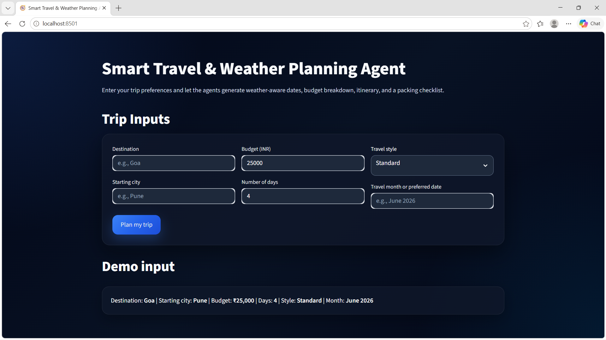
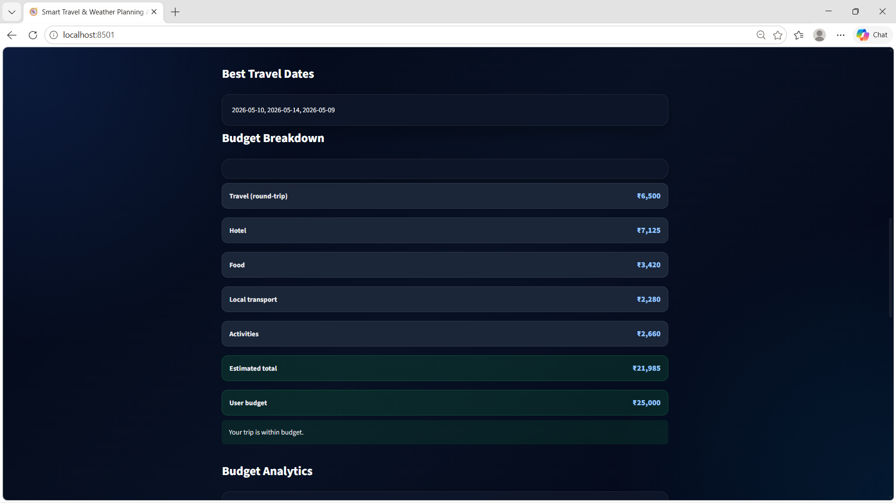
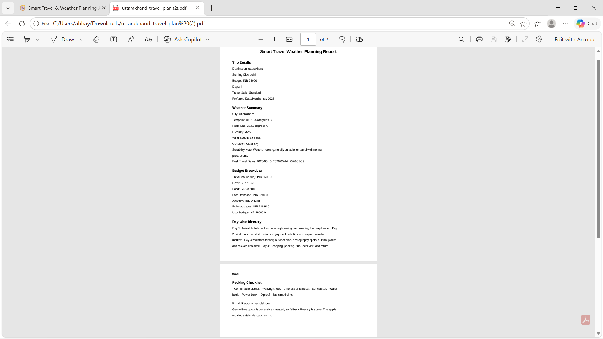

# 🧭 Smart Travel & Weather Planning Agent

An AI-powered travel planning web app built with **Streamlit**, **Gemini API**, **Groq API**, and **OpenWeather API**.

This app helps users plan a trip by generating weather-aware travel dates, budget breakdown, hotel recommendations, day-wise itinerary, packing checklist, and a downloadable PDF travel report.

---

## Live-https://smart-travel-weather-planning-agent-srmbdflbvknlgcbukik6uj.streamlit.app/

## 🚀 Live Features

- 🌦️ Real-time weather summary
- 🌡️ 5-day temperature forecast graph
- 📅 Best travel date suggestion
- 💰 Budget breakdown in INR
- 📊 Budget analytics donut chart
- 🏨 Smart hotel recommendations
- 🧭 AI-generated day-wise itinerary
- 🎒 Weather-aware packing checklist
- 📄 Downloadable PDF travel report
- 🤖 Gemini API with Groq fallback
- 🎨 Premium dark glassmorphism UI

---

## 🖼️ Project Screenshots

### 🏠 Home Page


### 🌦️ Weather & Result Section


### 📊 Budget Analytics


### 🌡️ Temperature Forecast Graph


### 🏨 Hotel Recommendations


### 📄 PDF Download Section


---

## 🛠️ Tech Stack

- Python
- Streamlit
- CrewAI
- LangChain
- Gemini API
- Groq API
- OpenWeather API
- Plotly
- FPDF2
- python-dotenv

---

## 📁 Project Structure

```bash
Smart-Travel-Weather-Planning-Agent/
│
├── smart_travel_agent/
│   ├── app.py
│   ├── agents.py
│   ├── tools.py
│   ├── config.py
│   ├── requirements.txt
│   ├── test_gemini.py
│   └── .env.example
│
├── images/
│   ├── home.png
│   ├── result.png
│   ├── budget.png
│   ├── graph.png
│   ├── Hotel Recommendations.png
│   ├── pdf.png
│   └── area.png
│
└── README.md
